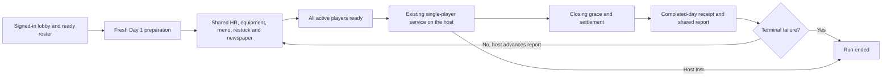

# Casual Dining multiplayer implementation

The latest task ownership, guest day-start, stockout feedback and circle repair uses protocol 6 and is documented in [MultiplayerTaskTrackingRepair.md](MultiplayerTaskTrackingRepair.md). The previous preparation repair is documented in [MultiplayerPreparationAndServiceRepair.md](MultiplayerPreparationAndServiceRepair.md). Earlier human service and payment work is documented in [MultiplayerHumanServiceParityRepair.md](MultiplayerHumanServiceParityRepair.md), and the preceding repair in [MultiplayerPlayabilityRepair.md](MultiplayerPlayabilityRepair.md). Runtime sign-off remains pending.

## Status and scope

Implementation added in source. Source paths and authored configuration were inspected; runtime acceptance is **pending**. No Unity editor, build, gameplay session, GUI automation or local test execution was performed. `git diff --check` is a source-format check only.

The agreed mode starts with 2–4 different signed-in accounts, runs a fresh restaurant from Day 1, and keeps the existing single-player preparation/service/settlement rules. Restaurant progress is disposable. Only account results and pending result receipts persist. The website is unchanged.

### Decisions implemented

- Count completed shifts beyond Day 30. Displayed run day advances through Day 31 onward; progression/difficulty uses the existing campaign limit and endless rules. Multiplayer bankruptcy still ends the scored run in endless mode.
- Failure ends the scored run permanently. No paid continue, campaign recovery, campaign save/checkpoint or wallet reward path is enabled for multiplayer.
- Freeze the host and account/actor roster at start; close the room to new entrants. No host migration or new late players.
- Host departure/disconnection ends the run. A guest has 90 seconds to rejoin the same live run. Remaining players continue, including a single remaining host.
- While a guest is absent, new day credit is provisional. Rejoin in time restores that credit; permanent departure keeps only the earlier earned completed/highest days.
- Fresh multiplayer runs begin with zero stock and no ingredient batches; campaign starter boxes and legacy refill migration do not seed a session. Stored purchases persist between days and across guest rejoin.
- The host requests Start Day from the computer's existing pre-open checklist and counts as ready. A centered popup uses the existing Blue/Double button assets and displays the ready/participant fraction. Guests toggle readiness there. All ready starts a synchronized three-second countdown and one authority-validated start. Preparation edits are locked until start or cancellation. Readiness withdrawal stops the countdown; disconnect cancels the request. The host can cancel without losing preparation panels. There is no bottom session bar or duplicate Leave Run control; exit remains in Pause.
- Only the host advances the day-end report into the next preparation day; guests see `WAITING FOR HOST`. Each day/request has fresh votes. A reduced connected roster may start only after an explicit new host request.
- Opening the exact current newspaper issue through either entry point satisfies the shared checklist. Reading is acknowledged independently of management edits and opening animation completion; archived issues cannot mark today's issue read.
- Task ownership labels are replaced by a small noninteractive actor circle: spinning during approach/carry or work without known duration, filling only during actual timed work. Availability/ownership checks remain enforced.

## Flow

Day progression is performed by `GameFlowManager` and `GameDayManager`; the bridges coordinate requests and replicate their outputs. Next day reuses the multiplayer scene, clears service tasks/items, resets booths/kitchen/takeout, and invokes normal preparation. A new run never loads the previous run's restaurant.

## Implementation map

All source paths below are relative to `Assets/_Project/`.

| Area | Single-player source of truth | Multiplayer implementation |
| --- | --- | --- |
| Sign-in/lobby | Existing PlayFab account | `Networking/Photon/PhotonBootstrap.cs`, `MultiplayerMenuController.cs`: account-backed Photon auth, readiness, compatible protocol, frozen roster |
| Lifecycle | Existing menu/scene loading | `Networking/Multiplayer/MultiplayerSessionManager.cs`: original-host authority, guest grace/rejoin, departure and end handling |
| Temporary state | Existing `GameSaveData` defaults and manager apply/capture methods | `MultiplayerProgressionContext.cs`: fresh state, persistence suspension and career-runtime restoration |
| Preparation | Employee/equipment/menu managers and authored catalog/assets | `MultiplayerRestaurantBridge.cs`: validated, idempotent shared operations and snapshots; management panels update shared state |
| Newspaper, market and rating | `Gameplay/CasualDiningPolishManager.cs` | Host prepares/finalizes the normal issue, prices/reviews/rating; guests observe and can request issue acknowledgement |
| Day/service/results | `Core/GameFlowManager.cs`, `Gameplay/GameManager/GameManager.cs`, objectives/finance | `MultiplayerDayBridge.cs`: readiness gates, clock projection, shared results and one settlement; actual run day separated from capped progression day |
| Restock | Existing inventory, orders, shelves, expiration and storage logic | `MultiplayerRestockBridge.cs`: single storage owner, validated requests, shared economy revision and disconnect release |
| Customer service | Existing group, booth, order-review, kitchen, bill and payment routines | `MultiplayerCustomerInteractionBridge.cs`, `MultiplayerCustomerSpawn.cs`: claims, host validation, service outcomes, eating and departure |
| Takeout and payment | `TakeoutFlowManager`, `TakeoutBagInteractable`, `CashierRegisterUI`, `CardPaymentUI` | `MultiplayerServiceActions.cs`: takeout order/bag delivery, cash/card reservations, host-calculated totals, exact change and accepted-payment feedback |
| Manager complaints | `Gameplay/ManagerComplaints/ManagerComplaintSystem.cs` | `.Multiplayer.cs` partial: one response owner; normal refund/remake/customer effects run on host; guests see shared dialogue/outcome |
| Dirty trays and cleaning | Existing busser hands, sink, booth cleaning and task rules | `MultiplayerServiceActions.Cleanup.cs`: tray reservation, transport, washing and disconnect recovery; normal bot tray/trolley/sink/mess routines |
| Staff and carried objects | Existing hires/assignments, four lobby roles, kitchen roles and upgrades | Staff bridges plus `MultiplayerObjectBridge.cs`: host staff simulation, kitchen/trolley/tray/bill poses and actual authored item replicas |
| Local controls/UI | Existing Manager, computer, service panels and task HUD | `ManagerNetworkOwnership`, `MultiplayerSessionUI`, `MultiplayerHUDBridge`: own-avatar controls, readiness/status/leave, task guidance and disconnect blocking |
| Account records | Existing PlayFab authentication | `MultiplayerRunRecords.cs` and `Backend/PlayFab/MultiplayerRunsV2.js`: account-bound receipt retries, participant credit, Max statistic and last-run summary |

The inspected `Lobby1` and `Lobby1 Multiplayer` scene blocks use matching GameDay/Kitchen settings: service hours, duration/scaling curves, closing grace, spawn thresholds, cooking timings, tray/bag prefabs and output slots. No scene or prefab asset was regenerated. Future gameplay-rule changes should continue to enter through these shared managers/assets.

## Ownership and consistency

- Human requests carry run/day identity, an authenticated actor and the target/action. Management/service mutations use request IDs and receipts; restock uses actor sequences. Retries do not repeat a successful mutation within a day.
- The host validates current customer phase, claim ownership, distance, hands, prices, storage and stock through the relevant shared systems. Clients supply choices, not rewards or payment totals.
- World/day/restock economy revisions prevent an older inventory or money snapshot overwriting a newer one. Unchanged management data avoids repeated UI/model resets.
- Lobby/kitchen staff and trolleys execute on the original host. Guests project actual staff/item state. Human reservations exclude conflicting bot work.
- Prepared-tray parent/slot identity is preserved. Dirty trays, bags and carried cash are returned/released on owner loss. Bill/order claims are cleared or recovered through their normal bridges. Each new day clears previous tasks/items and rejects earlier-day actions.
- Disconnect closes local service/computer panels and blocks controls. Rejoin restores the same account/actor and live snapshots before controls return. An ended run cannot become a locally simulated single-player game.
- A new load acknowledgement is required after each guest disconnect. PUN avatar teardown preserves shared carried items on the host; observers discard stale item replicas before rebuilding the live view. Ownership handling follows the installed SDK and [Photon's ownership/rejoin rules](https://doc.photonengine.com/pun/current/gameplay/ownershipandcontrol).

## Result semantics and backend gate

The score is the number of fully settled days, including a terminal failed shift. Reaching preparation or an unfinished service day does not increment it. Leaving during Day 13 after settling Day 12 records 12 completed days and highest day 13. A player who departed earlier retains their own lower values even if the team continues.

`Backend/PlayFab/README.md` defines the setup and contract. Deploy the two CloudScript handlers and configure a server-written **Max** statistic before expecting account sync. Room creation/joining uses the existing Photon connection by default and remains independent of result-service setup. Photon–PlayFab custom authentication is an explicit option after dashboard configuration. The latest-run summary and the numeric personal best serve different purposes; no website changes are included.

**Durability limit:** local result receipts survive a normal application restart, but they are not resume saves. If the host crashes before uploading a completion, guests cannot independently authorize a higher verified score. That completion remains pending until the host returns and uploads its outbox. Previously acknowledged scores remain secured. Guaranteed finalization without that host requires trusted server-side recording, which is not implemented here.

**Trust limit:** this is authenticated player-hosted cooperation. It is not a cheat-proof competitive leaderboard. Runtime and backend quota/performance behavior remain unverified.

## External acceptance matrix

These checks have not been run. Use external test devices/CI and a non-production title; do not launch Unity or run tests on the user's computer under the current instruction.

| Scenario | Required observation |
| --- | --- |
| Compile/import | All scripts compile in the project's pinned Unity version; new script metadata imports; no missing authored references |
| Sign-in and lobby | Signed-out entry rejected; 2/3/4 unique accounts join correct protocol; ready/unready/leave/retry work; host waits for all ready; unavailable result registration remains pending without blocking room connection |
| Two full days | Shared newspaper, HR, assignments, equipment, menu prices, restock, service and report; salary/stock/revenue/approval applied once; ready next day produces fresh tasks with retained in-run purchases |
| Human service | Greet/seat/order/review/confirm/cook/pickup/serve/eat/bill/cash/change/card/depart/dirty-tray/sink/mess-cleaning works from every actor |
| Bot service | All hired lobby and kitchen roles perform their normal jobs; human/bot collisions have one winner; no free equipment/staff from party size; upgrade trolleys transport/deliver/wash visibly on guests |
| Error and complaint paths | Wrong/burnt order and other existing complaint types produce normal feedback; one owner responds; remake gets a fresh order; rejected trays can be removed while seated; refund/penalty happens once |
| Takeout | At the existing unlock threshold (Day 20), front customer orders, pays, waits for cooking, receives correct bag and leaves; multiple queued groups advance; legacy counter clicks cannot skip service |
| Results and terminal outcomes | Closing grace remains bounded; final customers cannot hang results; shared objective/finance/rating report; bankruptcy/approval/Day-30 failure ends run; no paid recovery or duplicate settlement |
| Day 30 and beyond | Day-30 success permits endless; successive days show 31, 32, etc.; completed-day score advances; existing capped difficulty/unlocks are preserved; endless bankruptcy ends the run |
| Guest rejoin | Disconnect during preparation, service and report; restore same account/actor within 90s; no extra avatar; input remains blocked until snapshot; provisional credit awarded only after successful rejoin |
| Guest departure/expiry | Leave explicitly or exceed 90s while holding tray/bag/bill/money, answering a complaint or using stock room; ownership releases/recovery works; no later credit; remaining team can finish and start another day |
| Host loss | Quit/disconnect/crash during each phase; every guest ends without migration; no authoritative bot/customer/economy continuation; earned result retained locally, backend pending/synced state honest |
| Network races | Duplicate/out-of-order requests, delayed previous-day messages, packet loss and rejoin snapshots; no duplicate payment/stock/expenses; prepared trays retain pickup slots; stale snapshots cannot undo newer economy |
| Backend (separate external verification) | Max configuration; host upload credits offline guests; delayed guest claims, shorter runs, receipt-slot reuse, partial failure, out-of-order host revisions and multiple accounts/devices; custom authentication only if explicitly enabled and configured |
| Storage and isolation | API outage and reconnect; corrupt/unwritable result outbox; one unresolved claim does not block later runs; account switch never uploads another account's receipt; career save/checkpoint/wallet unchanged after leaving |
| Fresh second run | Leave then start another run without restarting the app; Day 1 defaults, new roster/run ID, no old static state, carried objects, tasks or room receipts |
| UI and performance | Desktop/mobile safe areas, touch/mouse/card drag, overlapping panels, ESC/local pause; 4-player busy-day snapshots within Photon/PlayFab traffic and latency budgets |

## Completion boundary

### Connection regression correction

The initial implementation made PlayFab–Photon custom authentication mandatory before connecting. This introduced a new dashboard dependency into the existing working room path. The correction restores standard Photon connection by default while retaining mandatory PlayFab sign-in, makes custom authentication opt-in, reports connection failures immediately, and lets the menu submit pending room requests when the connection becomes ready even if a callback was missed. The connection's protocol version is set on a runtime AppSettings copy because the installed PUN SDK overwrites GameVersion inside ConnectUsingSettings. Token callbacks from expired attempts cannot start a later connection. Source review only; no Unity or connection test was launched for this correction.

Code and backend/setup artifacts are provided. Local runtime testing was intentionally not performed. Backend deployment/configuration, compilation and the external acceptance matrix are outstanding release gates. Do not describe this mode as fully verified until those gates pass.
